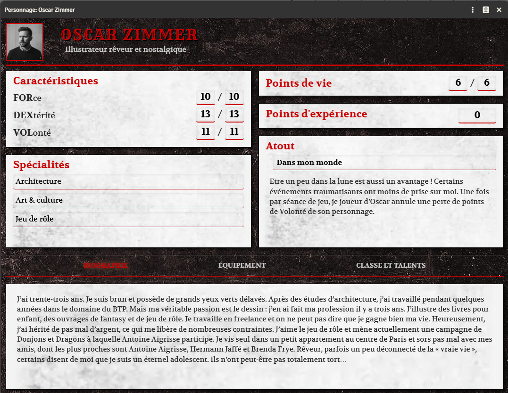

# Système Dangerous Gary pour Foundry VTT

# Disclaimer

Dangerous Gary © est un jeu de rôle édité par Les XII Singes © 2025

La marque Les XII Singes est la propriété de ReSpell © 5 bis avenue des Clairs-Chênes 95370 Montigny-lès-Cormeilles. Basé sur le SRD de Mark Of the Odd par Chris McDowall, auteur de Into the Odd www.bastionland.com.
Les marques Dungeons & Dragons © et Mordenkainen © sont la propriété de Wizards of the Coast © et sont utilisées au titre des droits de citation, de création transformative et d’hommage sans autre exploitation de leur contenu. Les termes Tenser et Robilar sont la propriété de leurs créateurs et ayants-droits et sont utilisés au titre des droits de citation, de création transformative et d’hommage sans autre exploitation de leur contenu.

Les visuels utilisés sur Foundry VTT sont réalisés par Maxime Plasse (https://www.maxsmaps.com/). Ils sont fournis pour l'utilisation de Foundry VTT. Toute autre utilisation ou reproduction d'image doit obtenir l'accord de ReSpell / Les XII Singes.

# Contribution

Ce système est développé par Kristov.

# Fonctionnalités

## Général

  - Localisation : anglais et français
  - Token lié automatiquement pour les personnages, avec vision activée
  - PV et FOR affichés sur les barres du token (attribut primaire et secondaire)
  - Grille configurée en mètres (1,5m par case)
  - Compatible Foundry VTT v13

## Fiches de personnage

  - Caractéristiques : Force (FOR), Dextérité (DEX) et Volonté (VOL), chacune avec valeur courante et maximum
  - Points de vie (PV) avec valeur courante et maximum
  - Points d'expérience (XP)
  - Atout : nom et description en texte riche
  - Spécialités : trois emplacements de spécialité
  - Biographie : éditeur de texte riche dédié (onglet)
  - Portrait modifiable
  - Slider Lecture/Écriture : bascule entre mode consultation (verrouillé) et mode édition sur toutes les fiches (personnages, rencontres, items)

  ## Inventaire

  - 3 sous-types d'équipement : équipement, armure, arme
  - 7 catégories d'armes : mêlée, armes de mêlée, armes à distance, grandes armes de mêlée, pistolets, fusils, armes de guerre — chacune avec formule de dégâts et dégâts critiques
  - Équiper/déséquiper les objets en un clic
  - Dégâts critiques : les armes marquées « critique » utilisent le modificateur de dé xo (explosion unique) ; une icône s'affiche dans le chat uniquement quand le dé a effectivement explosé
  - Objet encombrant (bulky) : indicateur visuel dans l'inventaire
  - Points d'équipement : compteur sur l'onglet inventaire
  - Description enrichie affichée en tooltip au survol du nom de l'objet
  - Zone de saisie libre "Équipement divers" sous la liste d'items

  ## Artefacts (optionnel, nécessite l'activation des classes)

  - Type d'item dédié, distinct de l'équipement
  - Capacités déverrouillables par niveau de classe
  - Utilisation d'une capacité avec message dédié dans le chat

  ## Jets de dés

  - Jets de sauvegarde : 1d20 sous la valeur de la caractéristique (FOR/DEX/VOL) — critique sur 1, fumble sur 20
  - Shift+Clic sur une caractéristique : jet de classe (contre la valeur maximum)
  - Jets de dégâts : formule configurable par arme/attaque, avec support des dégâts critiques (explosion de dé)
  - Attaques contraintes et exaltées : Shift+Clic sur le dé de dégâts pour choisir le type (contrainte = 1d4, exaltée = dégâts max)
  - Cartes de chat personnalisées avec portrait de l'acteur, résultat du jet, icônes de succès/échec/critique/fumble
  - Infobulle dans le chat précisant le type de sauvegarde (caractéristique ou classe)

  ## Repos

  - Boutons de repos accessibles dans la barre de titre de la fiche
  - Repos court : restaure les PV au maximum
  - Repos complet : restaure les PV + récupère 1 point par caractéristique
  - Repos en sécurité : PV + 2 points par caractéristique
  - Repos médical : PV + 3 points par caractéristique

  ## Classes & Talents (optionnel)

  - 9 classes : Clerc, Guerrier, Paladin, Druide, Moine, Voleur, Barde, Mage, Rôdeur — chacune avec un niveau de 0 à 9
  - Talents associés à une classe, avec niveau (1-9), description et marqueur spécial
  - Jet de classe : jet de sauvegarde contre le maximum de la caractéristique associée (FOR pour Clerc/Guerrier/Paladin, DEX pour Druide/Moine/Voleur, VOL pour Barde/Mage/Rôdeur)
  - Échec de talent : perte de PV égale au niveau du talent, le surplus déborde sur la FOR
  - Osmose : jauge à 3 niveaux cliquables
  - Compendium de talents inclus activable/désactivable via l'option du système "Active l'onglet Classe et talents sur la fiche de personnage"

  ## Fiches de rencontre (PNJ/Monstres)

  - Caractéristiques (FOR/DEX/VOL), PV, valeur d'armure
  - Description et pouvoirs en texte riche
  - Attaques : items dédiés avec formule de dégâts et description
  - Jets de sauvegarde et de dégâts depuis la fiche
  - Drag & drop d'attaques depuis le compendium ou d'autres sources

  ## Macros & Hotbar

  - Drag-and-drop des armes vers la hotbar : Clic = jet de dégâts, Shift+Clic = options (contrainte/exaltée)
  - Drag-and-drop des caractéristiques vers la hotbar : Clic = jet normal, Shift+Clic = jet de classe (max)
  - Drag-and-drop des talents vers la hotbar : jet de sauvegarde de classe

  ## Combat

  - Initiative automatique : les PJ passent avant les PNJ
  - Combat tracker personnalisé : pas de boutons de jet d'initiative ni d'affichage d'initiative (initiative côté-basée)
  - Réorganisation par drag & drop de l'ordre des combattants dans le tracker (MJ uniquement)
  - Bouton "A joué" (MJ et propriétaires) pour marquer un combattant comme ayant agi
  - Au début de chaque round, les PJ sont automatiquement classés par dextérité décroissante
  - Les combattants ayant joué sont automatiquement placés après ceux qui n'ont pas encore joué
  - Les combattants ayant joué sont visuellement atténués (opacité réduite)

# Communauté

Rejoignez-nous sur le serveur <a href="https://discord.gg/lafonderie">Discord francophone dédié à Foundry Virtual Tabletop</a> 
Nous serons ravis d'y avoir vos retours sur le système, des signalements de bug, des idées d'amélioration, ou simplement des encouragements !

# Licences
<ul>
<li>Le code HTML, CSS et Javascript de ce projet est placé sous <a href="https://choosealicense.com/licenses/gpl-3.0/">licence GNU General Public License v3.0</a></li>

<li>All HTML, CSS and Javascript in this project is licensed under <a href="https://choosealicense.com/licenses/gpl-3.0/">GNU General Public License v3.0</a></li>

<li>Foundry VTT support is covered by the following license: <a href="https://foundryvtt.com/article/license/">Limited License Agreement for module development 17/02/2021</a>.</li>
</ul>